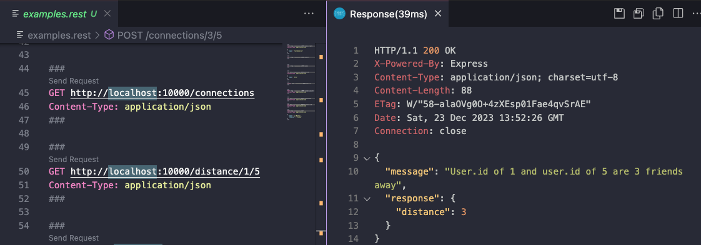

# Start here

1. Install Docker Desktop
2. Run `cp dev.env .env`
3. Update that .env's `POSTGRES_PASSWORD` with whatever you'd like. Both images of the Node server and Postgres will get that same value as needed.
4. Run `npm run start-initial`

### Optional

1. Install this [REST Client Addon](https://marketplace.visualstudio.com/items?itemName=humao.rest-client) inside Vscode for easy testing
2. You can then click on the Requests in example.rest like so:

# Notes

- On the .env thing, just wanted to reinforce never commiting passwords.
- TS used over just-JS to mimic a realer business situation
- Missing some interfaces
- Error handling patterns not quite uniform
- Feel free to message me any questions at louiemontes@gmail.com or [Linkedin](https://www.linkedin.com/in/luis-lj-montes-a3875b150/)
